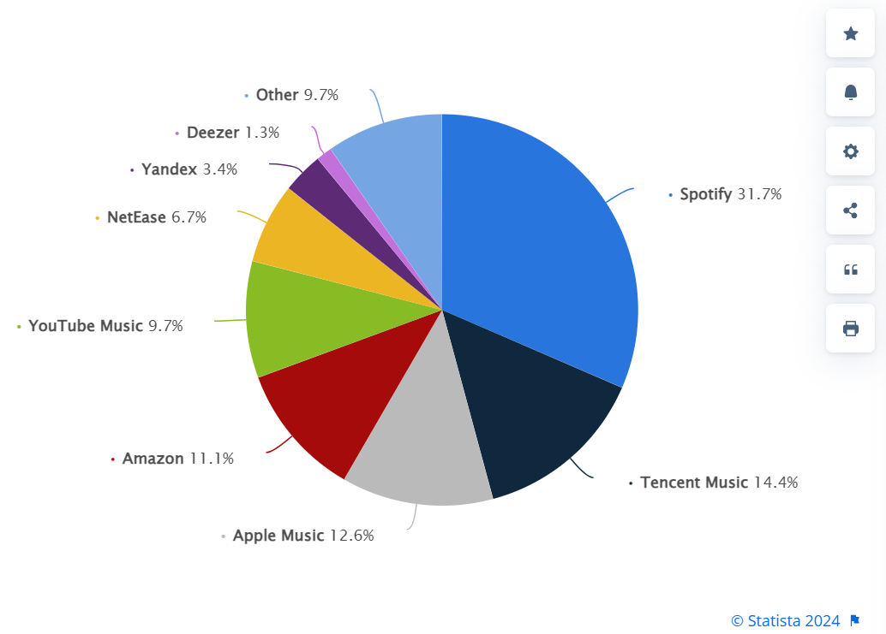

# Module 01 Challenge
# SPOTIFY

 - [I. Overview](#item-one)
 - [II. Business Description and Domain Landscape](#item-two)
 - [III. How Spotify Leverages AI](#item-three)
 - [IV. AI Aquisitions and Partnerships](#item-four)
 - [V. Spotify's Results](#item-five)
 - [VI. Recommendations](#item-six)
 - [VII. References](#item-seven)

<a id="item-one"></a>

## I. Overview

### Origins 
__Spotify__ is an audio and media streaming service founded on 23 April 2006 in Stockholm, Sweden by Daniel Ek and Martin Lorentzon.

Spotify was created to combat music piracy, which was decimating the mainstream music industry in the early 2000s. The founders wished to provide a service more reliable (and safer) than illegal downloading sites (like __Napster__ and __Limewire__) but less expensive than the pricy, pay-per-song, online music stores like __Apple Music__.

Existing streaming platforms limited the number of songs a user could stream.  Spotify intended to provide a basic limited music catalog for free, as easy as pirating, but where artists would get revenue for each stream.

Spotify launched in 2008 and opened public registration for a free service in the United Kingdom in 2010.  It launched one year later (2011) in the United States (delayed by additional music licensing agreements required for the United States).

Spotify utlizes a "Freemium" model (comprised of free, ad-supported subscriptions and Premium Subscriptions with monthly fees),


### Funding
  __February 2010__ Founders Fund, a San Francisco-based venture capital provides an initial investment. _Founders Fund was the first institutional investor in __Space Exploration Technologies (SpaceX)__ and early investor in __Facebook__.  It included board member __Sean Parker__, co-founder of __Napster__ and ex-president of __Facebook__._

__June 2011__
Spotify secured $100 million of funding (equivalent to $133,700,000 in 2023) and planned to use this to support its US launch.

__November 2012__
Goldman Sachs is part of $100M funding effort.

__April 2018__
Spotify goes public with a direct public offering.

_Spotify now operates utilizing a freemium business model, with basic services provided for free with advertising and premium services via paid subscriptions._

<a id="item-two"></a>

## II. Business Description and Domain Landscape

### Impact of Streaming Services

"The revenue generated from music streaming has seen an extraordinary surge in recent years. By 2022, it reached a remarkable annual figure of $17.5 billion. This growth trajectory is even more impressive when considering the historical context: between 2010 and 2020, music streaming revenue experienced a meteoric rise, increasing approximately 34 times from $0.4 billion to $13.6 billion."^9 

+ Music streaming makes up 84% of music industry revenue
+ The music streaming industry grew by over 10% over the last year
+ Music streaming’s global revenue currently sits at $17.5 billion
+ Paid music streaming makes up 23% of all music streaming
+ 78% of people listen to music via a streaming service
+ Over 600 million subscribe to a music streaming platform
  
Spotify provides over 100 million songs, 5 million podcasts, and 4 billion playlists.  They have over 600 million users across more than 180 countries worldwide. 

### Domain Trends

1. __Personalization and Optimization__ AI improvements allow more accurate genre and mood categorization, enhancing the relevance of music recommendations and highly personalized playlists.
+ Streaming companies are using Artificial Intelligence to improve personalization and optimization, to provide an overall better customer experience.

+ AI has improved content curation by providing automated tagging and classification of tracks, analyzing the audio of the tracks in addition to the metadata.

+ AI algorithms take listening history, user information, and utilize collaborative filtering to make content recommendations for music and podcasts.

2. __Targeted Advertising__
Improvements have been made in ad targeting, making advertising "more relevant and less intrusive."
 ```       
Spotify uses AI to analyze listening habits, serving ads that are more likely to align with the listener's interests. This not only enhances the user experience but also increases ad efficacy.^11
```
3. __Improved Search Usability__ Multiple audio (and video) streaming providers have improved search functionality with voice recognition and natural language processing.

<a id="item-three"></a>

## III. How Spotify Leverages AI

What sets Spotify apart is it's vast number of users, vast amount of data for the users, and the products it creates from it.  

It's content-filtering has evolved and includes advanced, proprietary features. They leverage exploring reinforcement learning to learn automatically based on feedback, to improve diversity of recommendations.

Spotify's strength lies in its unique ability to leverage user data and machine learning algorithms. By analyzing individual music preferences, search behavior, playlist data, geographical location and device usage, Spotify tailors personalized playlists and recommendations.^12

These AI-powered recommendations are the company's competitive advantage.^4

```
This ability to hyper-personalize audio recommendations to each and every Spotify user is impossible without AI. 
        
This means, in a very real sense, Spotify as a business today would not exist at its current scale without AI. 
        
According to the company, at least half a trillion events are processed daily to inform machine learning models. And the more data these models gather, the better they are at making higher-quality recommendations.^4
```  

### Spotify's AI Features

With the help of Artificial Intelligence, Spotify has introduced the following advanced features:

__Discover Weekly__: Custom-made AI playlists, customized for every user by the platform's AI algorithms. They are selected to align with users' listening preferences and designed to infer recommendations based on things like listening history, songs in their playlists, likes, dislikes.   

__Spotify Wrapped__:
An extremely popular feature is Spotify's end-of-year summary of a user's listening habits for the past year.  It includes a summary of top songs, genres, artists, albums and tabulates total listening minutes.

__AI DJ__: Spotify has introduced a humanistic voice that will serve as your personal disc jockey, to play tracks based:
```
on your specific music tastes and listening behavior...<and> curates tracks for you based on your individual user data, then narrates its selections in a hyper-realistic voice created by generative AI.^4
```
__AI Translated Podcasts__:
  
 ```
<Voice Translation for podcasts is> is an AI-powered feature, which translates podcasts into different languages—all in the podcast host's original voice. The tool uses OpenAI technology to match the AI-generated voice to the speaker's individual tone and style automatically.^4
```
 __AI-Driven Search__:
Spotify graduated from searching only exact words for search to match content to implementing AI technologies like natural language processing (NLP) and deep learning.  

Natural language search understands the semantic correlation between words, so it doesn’t need to exactly match your search with the words in a title to find what you’re looking for...natural language search can understand synonyms for different words, paraphrasing, and any content that means the same thing as what you searched.

<a id="item-four"></a>

## IV. AI Aquisitions and Partnerships

Spotify's leadership in implementing AI solutions in its offerings have benefitted from a number of AI-related aquisitions and partnerships:

+ __May 2013__: Spotify aquires music discovery app __Tunigo__, to improve music recommendation algorithms.
  
+ __March 2014__: Spotify aquires music intelligence company, __The Echo Nest__,to improve recommendations by employing:
    + __Collaborative Filtering__, which looks at patterns across data and associates tracks that are playlisted and listened together.
    + __Content-Based Filtering__ , using data such as release date, label, raw audio analysis (to identify sonic characteristics of a track), and "cultural context, which includes lyrics, descriptions from reviews, blogs, articles.

+ __June 2015__: __Seed Scientific__, is a data science consulting firm and analytics company, acquired to lead an advanced analytics unit within the company, focused on developing data services.

+ __January 2016__: Partnership with music annotation service __Genius__ is created, 
 ```
        bringing annotation information from Genius into infocards presented while songs are playing in Spotify. This includes background information, artist’s comments, and little easter eggs about the tracks <on> infocards presented while songs are playing in Spotify.^13
 ```
+ __March 2017__: __Sonalytic__, an audio detection startup, to be used to 
 ```
        improve the company's personalized playlists, better match songs with compositions, and improve the company's publishing data system.  Sonalytic uses machine learning to detect audio and recommend music.^1
   ```
+ __May 2017__ artificial intelligence startup __Niland__ is acquired to improve improve personalisation features and optimize music searches, recommendations for users.
 
+ __November 2021__ "Behind the Lyrics" replaced with auto-generated real-time lyrics (powered by lyrics provider __Musixmatch__).

+ __June 2022__, Spotify acquire London-based startup __Sonantic__, that has an AI-powered text-to-speech generator: an "AI engine to create very realistic-sounding, yet simulated, human voices from text."^15   
This is utilized in AI DJ to provide AI-generated commentary for users' AI-generated playlists. _This was the technology used in “Top Gun: Maverick" to recreate Val Kilmer’s voice._

<a id="item-five"></a>

## V. Spotify's Results

Although not the first music streaming service, Spotify is the world's largest, leveraging computational techniques and Artificial Intelligence to create highly curated and personalized music recommendations to its users.

Spotify is the online leader in the streaming of music and audio media, with over 30% of the music streaming market share. 

### Competition
The largest competitors in the Music Streaming space include __Tenecent__ Music (14.4% market share), __Apple Music__ (12.6%), __Amazon Music__ (11.1%), and __YouTube Music__ (9.7%).

__Music Streaming Market Share__


### Concerns

Since inception, Spotify has had a mostly negative net income.  There are multiple reasons that this is the case, despite their market dominance:

__The more users stream, the more Spotify has to pay__"
+ As a legal alternative to pirating music, Spotify and must licence content from the music catalogs of Sony, Universal, Warner. Additionally, royalties are paid to the rights holders (on average .003-.005 cents/stream).  Overall, nearly 75% of Spotify's revenue is paid between these costs.  

__Cost of Content__
+ The large record labels have the power to resist decreases in revenue paid for the rights to their catalogs.  Losing this content would result in loss of users to other streaming services, which share similar content.

__Diversification of Competition__
+ Larger, more diversified competitor companies (Amazon, Apple) can afford to lose money on music streaming services, as long as they are able to make money on other Bundled Services that are profitable.

__Common Content__
+ The music catalog is nearly identical across all the streaming services. Increasing subscription prices would result in users moving to similar, lower-cost services.


<a id="item-six"></a>

## VI. Recommendations

1. __Invest in Developing Original Content__
Much like Netflix, Max, Hulu, and Disney+ in the video streaming domain, Spotify needs to pursue creation of original content that will not require licence payments.

2. __Continue to Develop Live Music Content__

3. __Continue to Develop as a Podcasting Platform__
Podcasting provides extremely targeted content and the possiblity to produce original content.  Starting around 2018, Spotify have invested $1B to enter the podcast domain, licensing existing content for the rights of exclusive distribution, as well as acquiring companies with technologies ranging from collaboration, publishing, distribution, licensing.  Additionally they are developing "Spotify for Podcasters" tools, used for creating, managing, growing, and monetizing their content in one place.

4. __Diversify__
Continue to diversity to broader content to reduce dependency on what is essnetially a music catalog shared with competitors. Spotify has begun expanding its offerings to include:
   * __Podcasts__ (See above)
   * __Audio Books__
   * __Online Game Platform__
        Interfacing with Gaming platforms allowing users to display the music they are playing or even create communal "listening parties."
   * __Sports__
In 2022, Spotify became the official streaming partner of FC Barcelona

5. __Online Shopping__

6. __Highly Targeted Advertising__
Spotify has already invested heavily in its ad business, creating a highly customizable and curated ad marketplace.  They are uniquely positioned to provide highly targeting advertising to reach very specifically targeted users.


<a id="item-seven"></a>

## VII. References
1. Spotify Wikipedia https://en.wikipedia.org/wiki/Spotify
2. Spotify "About" https://investors.spotify.com/about/
3. Gartner: Few organisations have mature AI processes
https://www.computerweekly.com/news/366583348/Gartner-Few-organisations-have-mature-AI-processes
4. How Spotify Uses AI (And What You Can Learn from It)
https://www.marketingaiinstitute.com/blog/spotify-artificial-intelligence
5. How Spotify’s AI-Driven Recommendations Work
https://www.youtube.com/watch?v=pGntmcy_HX8
6. Why Spotify is in Major Trouble https://www.youtube.com/watch?v=-1J36DjsTAA
7. Understanding The Broken Business of Spotify
https://www.youtube.com/watch?v=mkSmUTK2FlY
8. Share of music streaming subscribers worldwide in the 3rd quarter of 2023, by company https://www.statista.com/statistics/653926/music-streaming-service-subscriber-share/
9.  Top Streaming Statistics In 2024 https://www.forbes.com/home-improvement/internet/streaming-stats/
10. Music Streaming Services Stats (2024) https://explodingtopics.com/blog/music-streaming-stats
11. Streaming Into The Future: How AI Is Reshaping Entertainment https://www.forbes.com/sites/neilsahota/2024/03/18/streaming-into-the-future-how-ai-is-reshaping-entertainment/?sh=274496ed3056
12. Case Study: How Spotify Prioritizes Data Projects for a Personalized Music Experience https://www.pragmaticinstitute.com/resources/articles/data/case-study-how-spotify-prioritizes-data-projects-for-a-personalized-music-experience/
13.  The Rising Power of the Modern DSP: Spotify https://medium.com/@jlicata_20400/the-rising-power-of-the-modern-dsp-spotify-c5bdd5dcd639
14. Spotify is acquiring Sonantic, the AI voice platform used to simulate Val Kilmer’s voice in ‘Top Gun: Maverick’ https://techcrunch.com/2022/06/13/spotify-is-acquiring-sonantic-the-ai-voice-platform-used-to-simulate-val-kilmers-voice-in-top-gun-maverick/